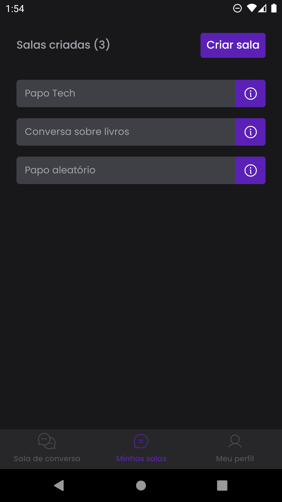

<h1 align="center">Chatyup</h1>

<p align="center">
  
  
  <a href="https://github.com/jtiagosantos/
chatyup/commits/master">
    
  </a>
  
   <a href="https://github.com/jtiagosantos/
chatyup/stargazers">
    
  </a>
</p>

<h4 align="center"> 
  🚧 Chatyup 📲 Completed 🚀 🚧
</h4>

<p align="center">
  <a href="#-features">Features</a> •
  <a href="#-run-project">Run Project</a> • 
  <a href="#-technologies">Technologies</a> • 
  <a href="#-author">Author</a> • 
  <a href="#-design">Design</a> • 
  <a href="#-license">License</a>
</p>

<br>

<h1 align="center">
  
  
  
  
  
</h1>


## ⚙️ Features

- [x] Sign In
- [x] Sign up
- [x] Recovery password
- [x] Create a chat room
- [x] Delete a chat room
- [x] Copy chat room code
- [x] Edit profile
- [x] Upload profile avatar
- [x] Enter in a chat room
- [x] Talk to other people in chat room

<br>

## 🚀 Run Project

1️⃣ Clone project and access its folder:

```bash
$ git clone https://github.com/jtiagosantos/chatyup.git
$ cd chatyup
```

2️⃣ Install dependencies:

```bash
$ npm i
```

3️⃣ Start project (with open amulator):

```bash
$ npm start
```

<br>


## 🛠 Technologies

The following tools were used in the construction of project:

- **[Expo](https://docs.expo.dev/)**
- **[Typescript](https://www.typescriptlang.org/)**
- **[Supabase](https://supabase.com/docs)**
- **[Zod](https://github.com/colinhacks/zod)**
- **[React Hook Form](https://react-hook-form.com/)**
- **[Dayjs](https://www.npmjs.com/package/dayjs)**
- **[Moti](https://moti.fyi/)**
- **[Expo Image Picker](https://docs.expo.dev/versions/latest/sdk/imagepicker/)**

<br>

## 🔖 Layout

You can view the project layout through the link below:

- **[Layout Mobile](https://www.figma.com/file/GjG5k2EiNimCglcKn2tJs2/ChatYup?node-id=0-1&t=n7u5FCll6EJzuOfG-0)**

<br>

## 👨‍💻 Author


<strong><a href="https://github.com/jtiagosantos">Tiago Santos </a>🚀</strong>

[](https://www.linkedin.com/in/josetiagosantosdelima/)
[](mailto:tiago.santos@icomp.ufam.edu.br)

<br>

## 📝 License

This project is under license [MIT](./LICENSE).
